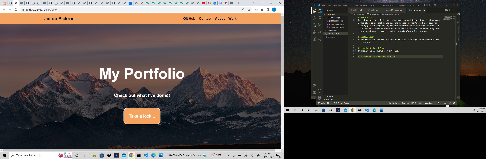
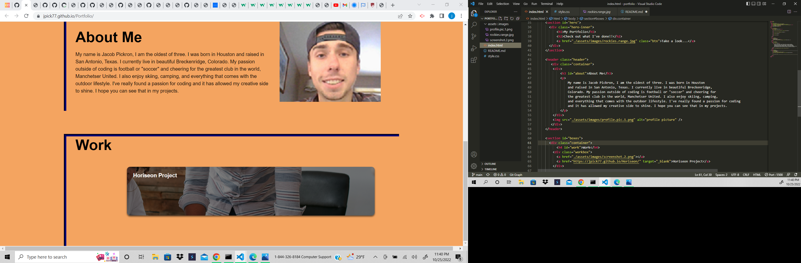

# Description
Here I created my first code from scratch, and deployed my first webpage.I was able to do that using css and flexbox properties. I was able to link my git hub page and my contact information to the page as links. I also presented some information about me and a recent picture of myself. I also used sematic tags to make the code flow a little more.

# Installation
Added reset css and media quieries to allow the page to be readable for all devices.

# Link to Deployed Page
https://jpick77.github.io/Portfolio/

# Screenshot of Code and website

<i class="fa-sharp fa-solid fa-j"></i>
